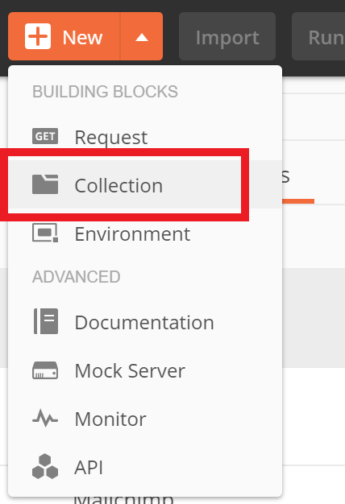
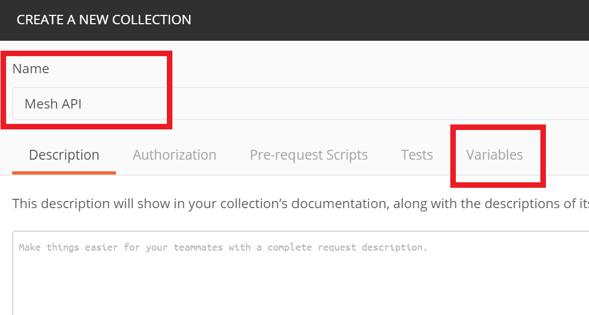
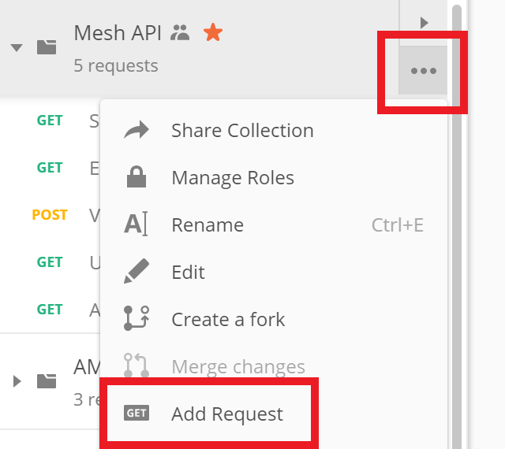
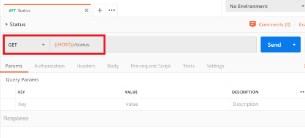
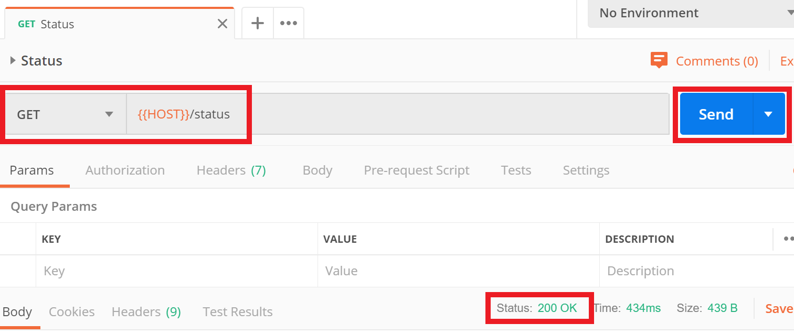

# Calling Mesh API with Postman

You can setup [Postman](https://www.getpostman.com/) automatically append HTTP headers that
required for authentication. Postman allows executing [custom code](https://learning.getpostman.com/docs/postman/scripts/pre-request-scripts/) before making any request within
collection.

Follow the steps for setup pre-request script:

- Create a new collection 


- Give it a name and open `Variables` tab



- Add 3 new variables in `CURRENT VALUE` column (this will prevent synchronizing values to Postman cloud):
  - `HOST` - the base URL of the API (e.q. https://example.com)
  - `API_KEY` - the API key that was provided to you
  - `API_SECRET` - the API secret 

- Now click on `Pre-request Scripts` tab and paste the code snippet below:
```js
const uuid = require('uuid');

// gather parameters
const timestamp = new Date().toISOString();
const nonce = uuid.v4();
const key = pm.variables.get('API_KEY');
const secret = pm.variables.get('API_SECRET');

// generate signature
const signature = `date:${timestamp}\nx-mesh-nonce:${nonce}`;
const signatureSigned = CryptoJS.HmacSHA256(signature, secret);
const signatureEncoded = CryptoJS.enc.Base64.stringify(signatureSigned);

// append headers
const auth = `HMAC-SHA256 Credential=${key};SignedHeaders=Date,x-mesh-nonce;Signature=${signatureEncoded}`;
pm.request.headers.add({key: 'Authorization', value: auth });
pm.request.headers.add({key: 'Date', value: timestamp });
pm.request.headers.add({key: 'x-mesh-nonce', value: nonce });
```
- Finally click on `Create` button

Now every request that will be created in the collection will have headers that required for authentication with Mesh API.

To add a request you will normally:
- <details>
    <summary>Click on add request</summary>

    
</details>

- <details>
    <summary>Define request URL</summary>

    
</details>

- <details>
    <summary>Execute request, which should return `200`</summary>
    
    
</details>
